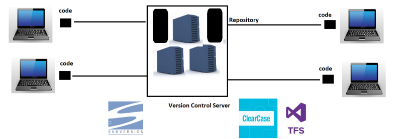
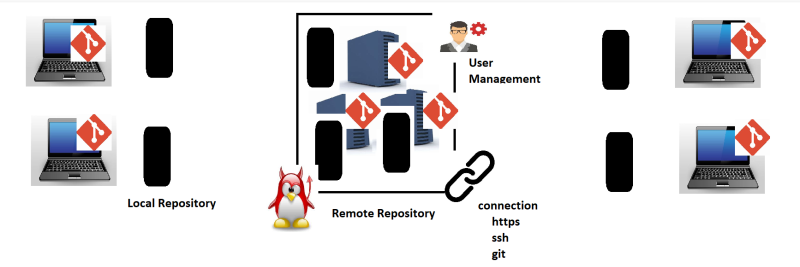
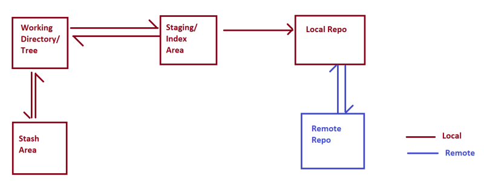

Git Preparation notes
---------------------
* This is a software which helps organizations to maintain the source code.
* VCS helps in maintaining history of changes
* VCS allows us to maintain track of different releases which we give to customers
* VCS allows parallel development by multiple developers
### Types of VCS
  * Local Version Control Systems
  * Centralized Version Control Systems
  
    * here main code will be stored in version control server only.
    * only respective code can be stored with local dev systems
    * if server breaks down, full code cannot be accessed 
    * can be accessed from same network and cannot be accessed over http
  * Distributed Version Control Systems
  
    * here we will have local repo and remote repo
    * and in this every local repo will have similar code as remote repo
    * so if we loss remote repo, we will have code in every local repo
    * and by this system we can maintain differerent branches and user management
    * we can connect over http and ssh and git
## Git
* Git is a Distributed Version Control System
* While using we have two options for Remote Repositories
  * Self-Hosted
  * Cloud-Hosted
    * Hosted by some service providers
      * GitHub
      * GitLab
      * Azure Source Repos
      * AWS Code Commit
      * Bit Bucket
### Git Work Flow

* Working Dir
* Staging Area
* Local Repo
* Remote Repo
* Stash Area